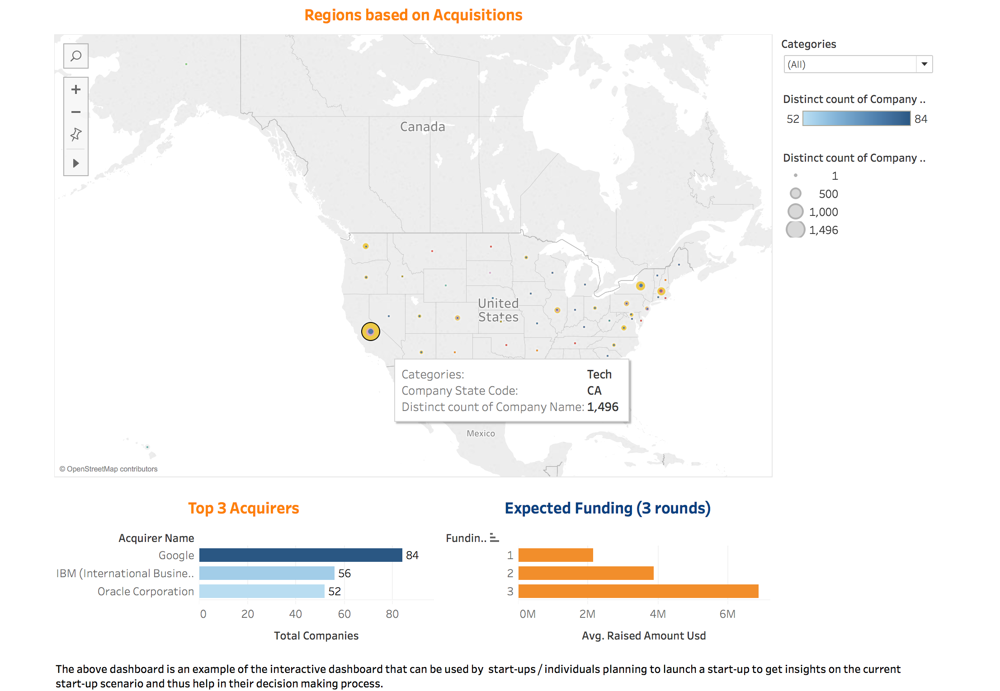

#### US Startup Trend Analysis:

__Objective:__

This project focuses on creating an interactive dashboard that can be used by the start-ups to get valuable insights before the launch of a start-up. It explores and analyzes the data pertaining to startups in USA from Crunchbase to evaluate current scenario and identify hidden patterns and visually present it using data visualization tool like Tableau. The objective of the project is to use data visualization not only to explore and analyze the data but to also focus on presenting and communicating the findings to technical and non-technical users. 

Few questions that have been addressed in the analysis:
1. Geographical analysis : Identifying best location to launch a start-up
2. Targeting - Identifying best investors and top acquirers for startups in different sectors
3. Analysis on the funding timeline for different sectors

__Data Overview:__

The analysis is carried on crunchbase data export from 2015. The dataset contains three important files: investments, companies, and acquisitions. It includes more than 66,000 companies that were founded between 1977 and 2015. Among these 66,000 companies, there were approximately 18,000 companies that were subsequently acquired. 
Data source : [source] 

[source]:https://github.com/notpeter/crunchbase-data

__Methodology and Analysis:__

1. Data Cleaning and Merging - Extracting data pertaining to US, data cleaning including handling missing values and merging relevant information.
2. Data Visualization for each type of the analysis  -
    * The analysis started with evaluating the current scenario which included identifying number of companies founded in different sectors, over time and locations, top investors, acquirers, funding amount for each sector etc. 
    * Building heat maps and looking for interactions such as between founded and funded helped uncover patterns and trends. 
    * Building dashboards for each of the section using relevant graphs and exploring features like geo-maps, filters,  trend lines to impactfully communicate the findings  
3. Story-Telling and Presentation - Combining dashboards and using story telling feature of tableau to present the findings.

